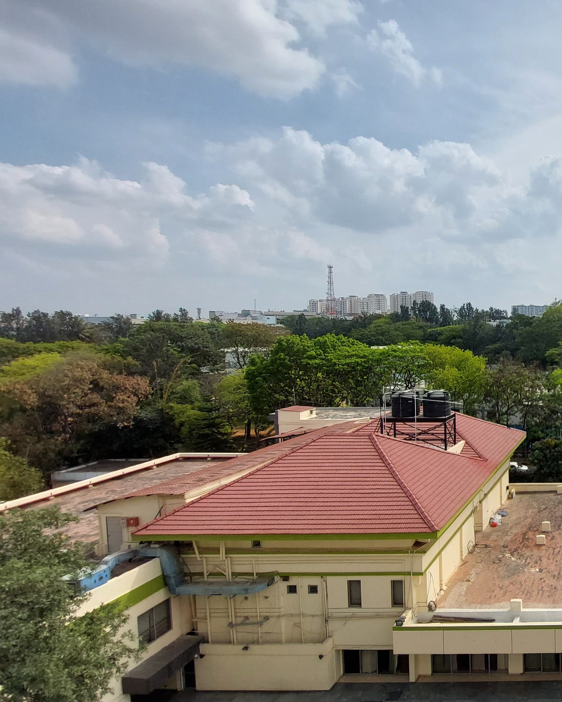
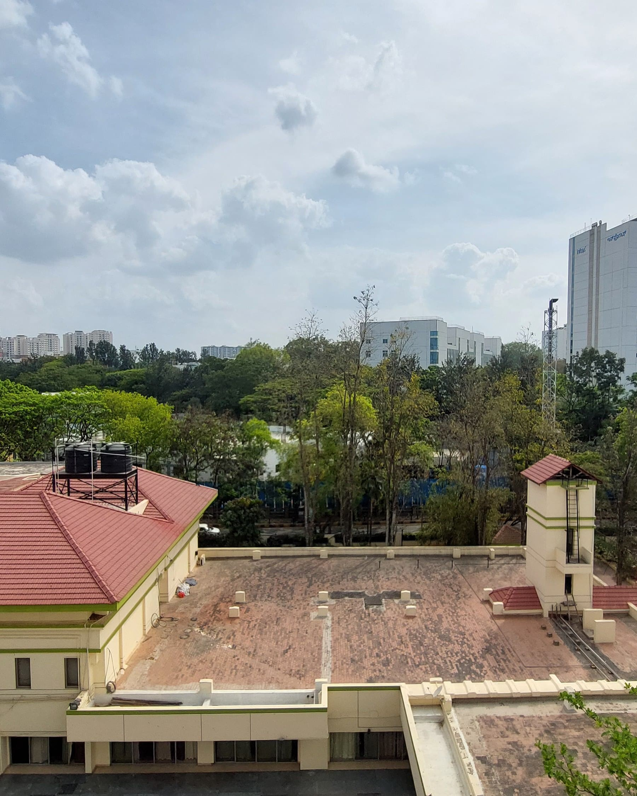
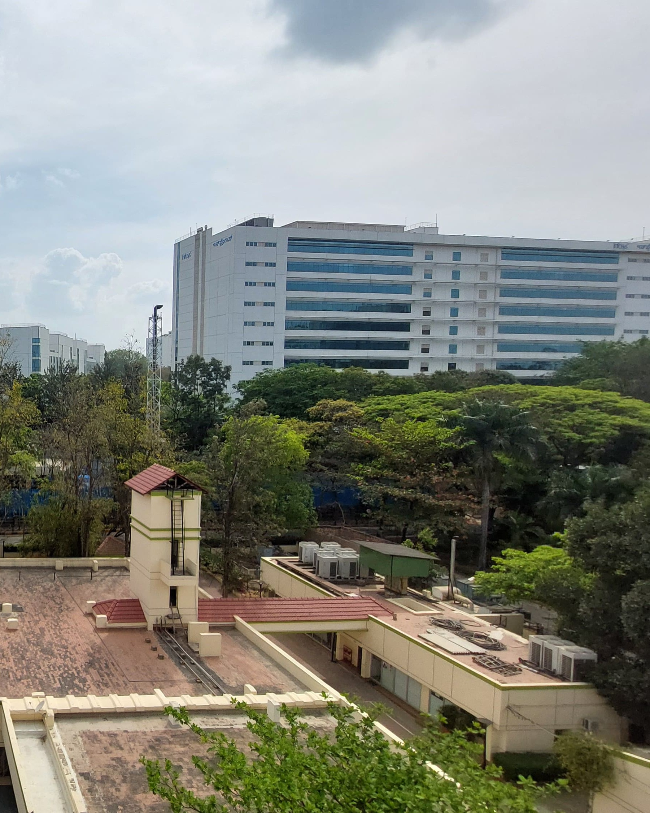

# Visual Recognition Assignment: Coin Detection and Image Stitching

## Overview
This project involves two main computer vision tasks:

### Part 1: Coin Detection, Segmentation, and Counting


*Input:* An image containing scattered Indian coins.

### Part 2: Image Stitching to Create a Panorama
*Input:* 3 images with overlapping regions.

## Folder Structure
```
project-root
├── input               # Folder for input images
├── output1a            # Output images for image transformations
├── output1b            # Output images for coin edge detection
├── output1c            # Output images for separated
├── output2             # Output images for stitched panorama
└── scripts             # Python scripts for processing
```

## Setup and Execution
1. **Clone the Repository:**
```
git clone <repository-url>
cd <project-folder>
```
2. **Set Up Virtual Environment:**
```
python3 -m venv env
source env/bin/activate  # For Linux/Mac
env\Scripts\activate     # For Windows
```
3. **Install Required Libraries:**
```
pip install -r requirements.txt
```
4. **Run Coin Detection and Segmentation:**
Notebooks `scripts/1.ipynb` and `scripts/2.ipynb` contain code corresponding to 1sta nd 2nd part. `scripts/help.py` reads an image to generate the histogram distribution of its intensities, use of which is explained in the report.
5. **View Outputs:**
- Coin image transformation `output1a`
- Coin edge detection in `output1b`
- Separated coins images in `output1c`
- Stitched panorama in `output2`


## Methods, Observations and Results

### Image Processing and Transformation

We applied several transformations on the input image to explore different visual enhancements and prepare it for further analysis. These transformations included:

- **Grayscale Conversion:** Simplifies image data by reducing the color channels.
- **Image Negative:** Highlights contrast by inverting pixel intensities.
- **Contrast Stretching:** Enhances the contrast by stretching pixel intensity across the entire range.
- **Histogram Equalization:** Adjusts the contrast using the image’s histogram for a more uniform intensity distribution.

The transformed images were saved in the `output1a` folder.
<p align="center">
  
  
</p>
<p align="center">
  
  
</p>


### Edge Detection and Highlighting

We applied the Canny edge detector to highlight edges in the processed images and enhanced them by overlaying detected edges in green. Gaussian blurring was used before edge detection to reduce noise (***specially the 2 concentric cicles in 10 rupee coin***) and improve detection accuracy. The highlighted images were saved in the `output1b` folder.

<p align="center">
  
  
</p>
<p align="center">
  
  
</p>

### Region-Based Segmentation and Contour Detection

To identify and isolate individual objects (coins) in the image, we performed:

- **Gaussian Blurring:** Applied with a larger kernel to smooth the image.
- **Binary Thresholding:** Used to convert the image to a binary form, making objects more distinguishable.
- **Contour Detection:** Extracted the contours of each object.
- **Bounding Boxes:** Drew rectangles around each detected object and saved individual object images.

The number of detected objects (coins) was counted and visualized, individual coin images saved in `output1c` folder.

<p align="center">
  
</p>

### Feature Detection and Image Stitching

Using the SIFT (Scale-Invariant Feature Transform) method, we extracted keypoints and descriptors from two images:

- **Feature Detection:** Identified and visualized distinctive keypoints.
- **Keypoint Matching:** Applied the BFMatcher with a ratio test to match keypoints between two images.
- **Homography Estimation:** Calculated a transformation matrix to align images.
- **Image Stitching:** Combined two images into a seamless panorama.

The stitched images were saved to `output2` folder.

Original images (image1.jpeg, image2.jpeg, image3.jpeg):
<p align="center">
  
  
  
</p>

Final stitched image 'output2/stitched2.jpeg':
<p align="center">
  
</p>


## Requirements
- Python 3.8+
- OpenCV
- NumPy
- Matplotlib


